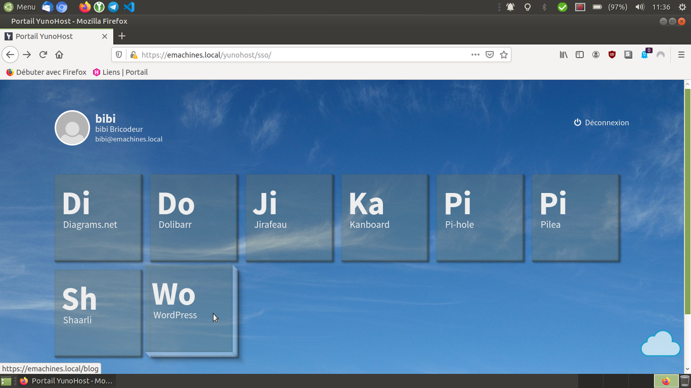

Theme pour la distribution orientée auto-hébergement [YunoHost](https://yunohost.org/#/).
=======================================

* * *

[source background](http://absfreepic.com/free-photos/download/blue-sky-1920x1272_13216.html)

Pour changer de thème

```shell
sudo nano /etc/ssowat/conf.json.persistent
```
Pour mettre celui-ci après l'avoir cloné dans `/usr/share/ssowat/portal/assets/themes/`

```shell
{
    "theme" : "YunoTheme"
}
```


* bibibricodeur

## License

[The Unlicense](https://choosealicense.com/licenses/unlicense/)

### Fin
